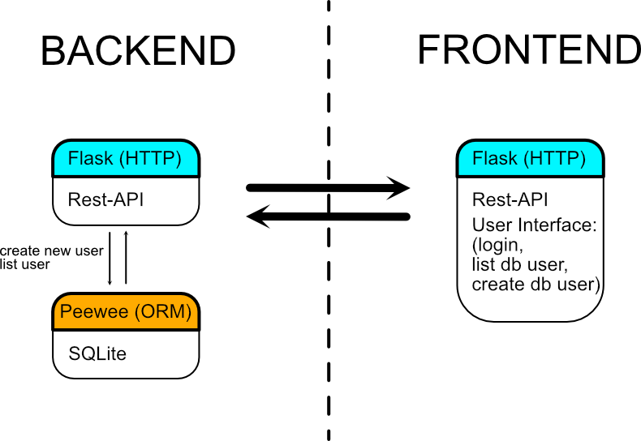
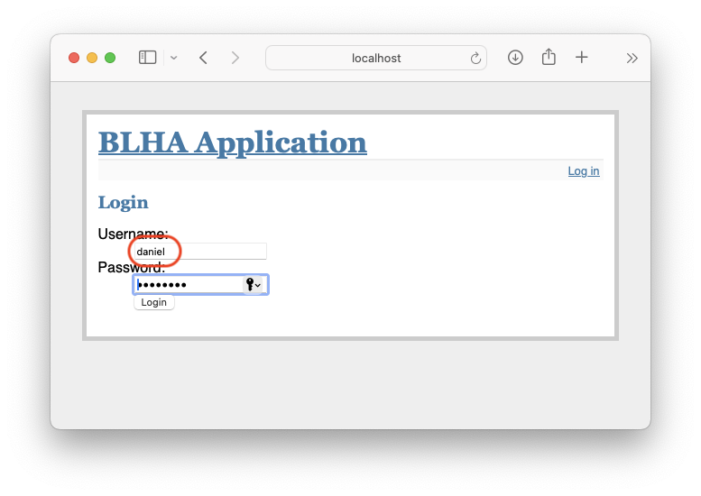
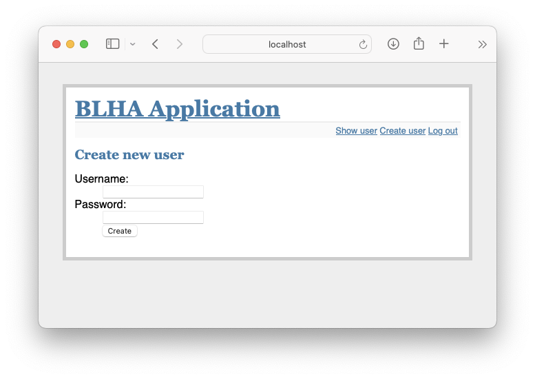
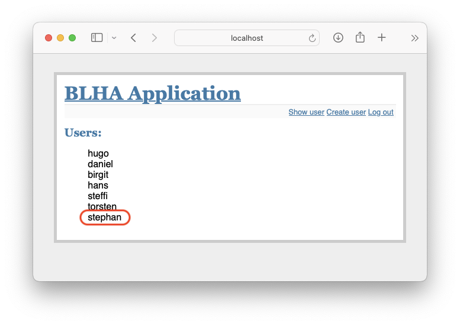

# BLHA application

## Overview

Aim of the project is to implement a simple user login system with a small set of user management features. The implementation approach should consist of a database backend system, which performs the database information exchange using object-relational mapping (ORM). For passing information between back- and frontend a Rest-API have to be realized.  



The backend features a Rest(ful)-API to access the database indirectly. It establishes the database connection using ORM and allows requesting an list of created users and the creation of new ones. The user list represented as JSON string.

### DB Scheme

To abstract a very simple user list, the following database scheme is used:

```
DROP TABLE IF EXISTS users;

CREATE TABLE users (
  id INTEGER PRIMARY KEY AUTOINCREMENT,
  username TEXT NOT NULL,
  password TEXT NOT NULL
);
```

## Getting started

### Dependencies 

This solution relies on [Flask](https://flask.palletsprojects.com/en/3.0.x/) and [Peewee ORM](https://docs.peewee-orm.com/en/latest/) and was implemented using Python 3.9.6. Flask is used for serverside functions and listening on ports 8001 (backend server) and 8002 (frontend server).

#### Dependencies (Python packages) for running the backend

```
flask flask_restful peewee
```

#### Dependencies (Python packages) for running the frontend

```
flask requests
```

### Prepare database 

For preparing the SQLITE database run either the following snippet:

``` 
sqlite3 database.db < db/scheme.sql
```

or use the ORM mapping to create the database, establish the database scheme and create some artifical entries. 

```
python3 db/dbmodel.py
```


## Testing in using a virtual enviroment ([virtualenv](https://virtualenv.pypa.io))

1. Create a new virtual enviroment (Python3):

```
virtualenv -p python3 <desired-path>
```

2. Activate the enviroment.

```
source <desired-path>/bin/activate 
```

3. Install the required dependencies:

```
pip3 install flask flask_restful peewee requests
```

4. Create a fresh database using the ORM approach.

```
python3 db/dbmodel.py
```

5. Start back- and frontend servers

```
python3 app_backend.py # listens on 8001
python3 app_frontend.py # listens on 8002
```

6. Start your webbrowser and navigate to [http://localhost:8002](http://localhost:8002)

The backend provides the user list on http://localhost:8001/users/ and the one of the default users will work for the login process.

```
hugo - T3stlauf
daniel - p455w0rt
birgit - ho53
hans - t35t
steffi - gru3n
torsten - 5chw4rz
```


7. Deactivate virtual enviroment

```
deactivate
```

## Screenshots 

Landing page of the front end without login:


Login form for user authentication:



Landing page turns into user list after successfull authentication:


Process of creating a new user:






And after the user has logged out:


## Drawbacks

1. Front- and backend did not use any kind of authentication or encryption
2. User passwords are stored and transferred in plain text
3. Database scheme allows non-unique usernames  