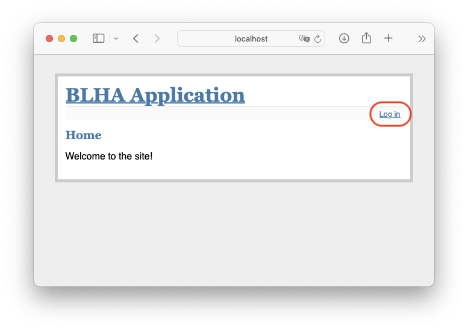
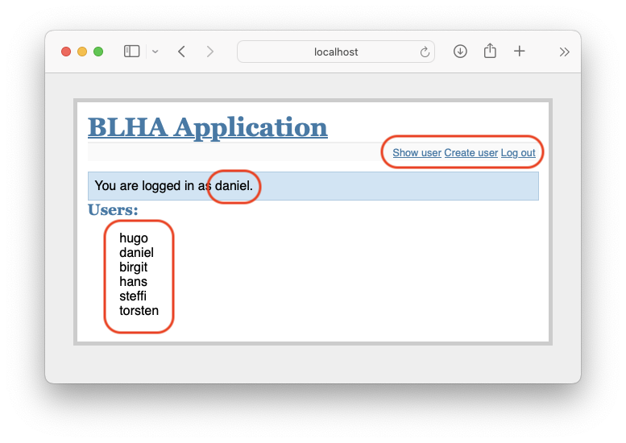
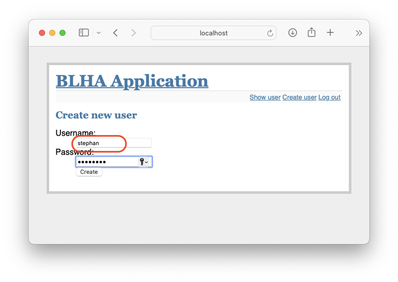

# BLHA application

## Overview

Aim of the project is to implement a simple user login system with a small set of user management features. The implementation approach should consist of a database backend system, which performs the database information exchange using object-relational mapping (ORM). For passing information between back- and frontend a Rest-API have to be realized.  


The backend features a Rest(ful)-API to access the database indirectly. It establishes the database connection using ORM and allows requesting an list of created users and the creation of new ones. The user list represented as JSON string.

### DB Scheme

To abstract a very simple user list, the following database scheme is used:

```
DROP TABLE IF EXISTS users;

CREATE TABLE users (
  id INTEGER PRIMARY KEY AUTOINCREMENT,
  username TEXT NOT NULL,
  password TEXT NOT NULL
);

```

## Getting started

### Dependencies 

This solution relies on [Flask](https://flask.palletsprojects.com/en/3.0.x/) and [Peewee ORM](https://docs.peewee-orm.com/en/latest/) and was implemented using Python 3.9.6.

#### Dependencies for running the backend

```
pip3 install flask flask_restful peewee
```

#### Dependencies for running the frontend

```
pip3 install flask requests
```

### Prepare database 

For preparing the SQLITE database run either the following snippet:

``` 
sqlite3 database.db < db/scheme.sql
```

or use the ORM mapping to create the database, establish the database scheme and create some artifical entries. 

```
python3 db/dbmodel.py
```

## Screenshots 

Landing page of the front end without login:



Login form for user authentication:


Landing page turns into user list after successfull authentication:



Process of creating a new user:




